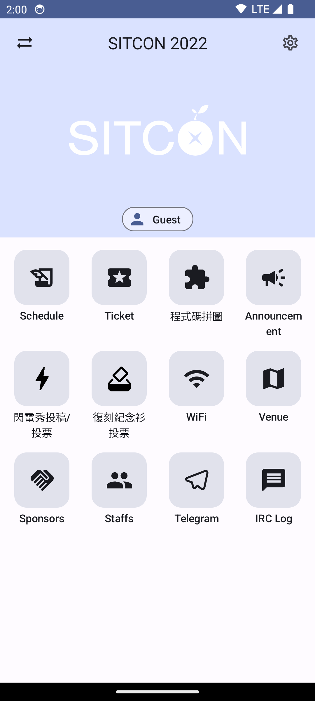

# OPass Compose

Status: **Work In Progress**

## Feature

- [x] Home
- [x] Switch events
- [ ] Sessions
  - [x] Browse
  - [ ] Details
- [ ] Ticket
  - [x] Enter manually
  - [ ] Scan a QR Code
  - [ ] Scan a image
  - [ ] Show my ticket
- [ ] WebView
- [ ] Settings
  - [ ] Save tokens
  - [ ] Local cache
- [ ] Material Design 3 theme

## Screenshot




## Development

### Format

```sh
./gradlew :app:ktfmtFormat
```

### Lint

```sh
./gradlew :app:detekt
```

### Build Debug APK

```sh
./gradlew :app:assembleDebug
```